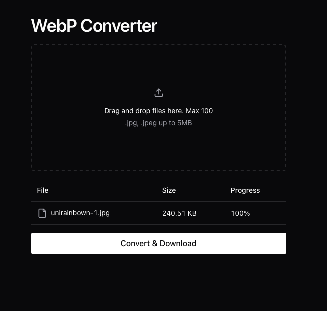

# WebP Converter 🖼️



## What is WebP Converter?
WebP Converter is a friendly, easy-to-use tool that helps you convert your images to the WebP format. WebP images are typically much smaller in file size compared to PNGs and JPEGs, while maintaining excellent visual quality. This means faster websites, reduced bandwidth usage, and improved page load times!
## Why Use WebP Converter?
- **Smaller File Sizes**: Reduce image sizes by up to 30% compared to JPEG without losing quality
- **Transparency Support**: Enjoy alpha channel transparency with file sizes smaller than PNG
- **Batch Processing**: Convert multiple images at once with our simple drag-and-drop interface
- **Simple & Fast**: No technical knowledge required - just drop your images and convert!

## Getting Started
### Prerequisites
- Node.js (version 22.14.0 or newer)
- npm package manager

### Installation
1. Clone this repository:

```Shell Script
   git clone https://github.com/franjorub/webp-converter.git
   cd webp-converter
```
2. Install dependencies:

```Shell Script
  npm install
```

3. Start the application:

```Shell Script 
  npm run dev
```

## How to Use
1. Drag and drop your images onto the designated area
2. Click the "Convert" button
3. Download your newly converted WebP images!

## Contributing
Contributions are always welcome! Feel free to open an issue or submit a pull request.
1. Fork the repository
2. Create your feature branch (`git checkout -b feature/amazing-feature`)
3. Commit your changes (`git commit -m 'Add some amazing feature'`)
4. Push to the branch (`git push origin feature/amazing-feature`)
5. Open a Pull Request

## License
This project is licensed under the MIT License.